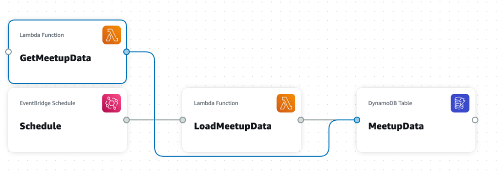

# Building a Serverless Python Workload with AWS Application Composer

This is the code for the following blog post TODO

The code was desgined using [AWS Application Composer](https://aws.amazon.com/application-composer/) and can be deployed using [AWS Serverless Application Model (SAM)](https://aws.amazon.com/serverless/sam/). 

The code highlights

* A scheduled Lambda function, that gets Meetup data and stores it in a databases
* An API to get the Meetup data
* A prototype front end application developed with [Streamlit](https://streamlit.io/) to display the data



You can deploy using

```bash
sam build
sam deploy --guided
```

**NOTE:** There are place hodlers for the [Meetup API Key](https://www.meetup.com/api/general/) and API Endpoints

To run the front end application run...


```bash
pip install streamlit
streamlit run meetup_st.py
```
